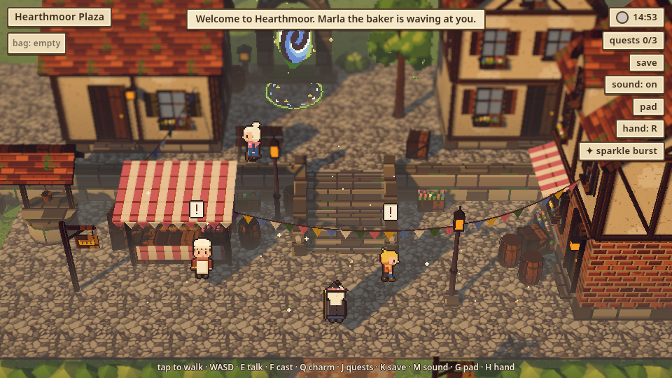

# hd2d-suite: cozy HD-2D game toolset

Pixel billboard actors in a lit 3D miniature, with a locked 3/4 camera, mild tilt-shift on the walk band, one warm key sun plus flickering lamps, sprite shadows, and warm-gold day / cool-blue dusk / orange-window night.
All art is original and generated by the tools in this repo, under a cozy HD-2D style lock: pixel billboard actors with nearest-neighbour scaling and a 1 px outline, a locked 3/4 camera with mild tilt-shift, one key sun plus lamps, a parchment / carved-wood HUD, no bloom, no blur, no free camera.

## Quick start: play Hearthmoor and the demos

**Play in the browser (phone or desktop):** https://unclebill-spec.github.io/hd2d-suite/
- Hearthmoor: https://unclebill-spec.github.io/hd2d-suite/games/hearthmoor/
- Hearthmoor Plaza demo: https://unclebill-spec.github.io/hd2d-suite/demos/hearthmoor-plaza/
- Bakery Lane demo: https://unclebill-spec.github.io/hd2d-suite/demos/bakery-lane/

To run locally: everything playable is plain static files (three.js r160 ES modules, no build step, no install). You only need Python 3 (or any static file server) and a WebGL2 browser.

```
git clone https://github.com/unclebill-spec/hd2d-suite.git && cd hd2d-suite

# Hearthmoor, the game: three areas, a portal, three cozy errands, save/load
games/hearthmoor/startup.sh                                     # http://localhost:8080/  (PORT=9000 to change)

# the two tool demos
python3 -m http.server 8077 --directory demos/hearthmoor-plaza  # http://localhost:8077/
python3 -m http.server 8078 --directory demos/bakery-lane       # http://localhost:8078/
```

Playable zips (unzip anywhere, serve the folder): `games/hearthmoor.zip`, `demos/hearthmoor-plaza.zip`, `demos/bakery-lane.zip`.

**Hearthmoor controls**, which all work at the same time:
- **Keyboard + mouse:** WASD / arrows walk (Shift runs), click to walk, wheel zooms. E / Space / Enter talks, F casts, Q switches charm, J quest log, K saves, M sound, G pad, H left-handed pad, Esc closes.
- **Touch:** tap to walk or talk, pinch to zoom. The Layout One pad has a floating stick (it appears under your thumb in the left half; the right half with the left-handed flip).
- **Controller** (Bluetooth / USB, standard mapping):

  | Input | Does |
  |---|---|
  | Left stick / d-pad | walk |
  | A | talk |
  | B | close |
  | X | cast |
  | Y / LB / RB | charm |
  | LT / RT | zoom |
  | Start | quest log |
  | Select | on-screen pad |

Saves live in the browser's localStorage (`hearthmoor-slot-1-v1`). More: `games/hearthmoor/README.md` and `games/hearthmoor/RESTORE.md`.

Tests (need `pip install playwright pillow numpy` and `playwright install chromium`):
`python3 games/hearthmoor/tests/smoke.py` (end-to-end playthrough) and `bin/hd2d check-scene demos/hearthmoor-plaza` (visual and phone QA).

Screenshots: `docs/screenshots/` (plaza, lane, lane at night, Mossglen, portal close-up, dialogue + quest log, phone portrait with the floating stick). The full QA shot sets (`shots/` folders) are regenerated by check-scene and the smoke test and are not in git.



Third-party: `tools/runtime/web/vendor/` is three.js r160 (MIT, © three.js authors), copied into each demo and the game.

Web-first: static three.js r160 ES modules with an import map (no build step), phone play (tap / Layout One pad with a floating stick, pinch zoom; the page itself never scrolls or zooms), Bluetooth/USB controllers (Gamepad API, standard mapping), a loading gate that swallows early input, `image-rendering: pixelated`, seed-deterministic tools.

## CLI

`bin/hd2d` (Python 3.13 + PIL/numpy; Playwright for check-scene; Node 20 for trees). Put `bin/` on your PATH or call `bin/hd2d` from the repo root.

| tool | one-line usage |
|---|---|
| palette | `hd2d palette --biome all --out P/public/art/palette` (5 biomes x 27 colours, .gpl, swatch, day/dusk/night grades) |
| sprite | `hd2d sprite --biome cozy-village --roles all --out P/public/art/sprite` (20x32, 4 facings x idle4+walk4 (+cast4 for magic users), 24 roles, atlas + JSON + 4x preview) |
| check-sprite | `hd2d check-sprite P/public/art/sprite/actors.png --biome cozy-village` |
| runtime | `hd2d runtime --out P` (three r160 diorama engine) |
| texel | `hd2d texel --biome cozy-village --sizes 32,64 --out P/public/art/texel` |
| kit | `hd2d kit --biome cozy-village --out P/public/art/kit --texel P/public/art/texel` |
| trees | `hd2d trees --biome cozy-village --out P/public/art/trees` |
| particles | `hd2d particles --biome cozy-village --out P/public/art/particles` (16 presets incl. fireflies, petals, snow, rain + splashes, embers, oven steam, pollen, fountain spray, butterflies, footstep dust) |
| spells | `hd2d spells --biome cozy-village --out P/public/art/spells` (9 pixel spell effects, 6-8 frame strips + JSON presets + cast sets) |
| portal | `hd2d portal --biome cozy-village --out P/public/art/gamefx` (game effects: portal vortex + ring decal, moonpetal pickup, quest tags) |
| assemble | `hd2d assemble scenes/hearthmoor-plaza.json --out demos/hearthmoor-plaza [--no-zip] [--shots]` |
| check-scene | `hd2d check-scene demos/hearthmoor-plaza` (+ phone portrait/landscape touch check; `--scene-dir areas/<id> --params "area=<id>&qa"` for a game area) |
| serve | `hd2d serve demos/hearthmoor-plaza --port 8077` |

Each tool lives in `tools/<name>/` with its own README. Shared helpers are in `hd2d_common/`. Scene specs are in `scenes/`.

## Demo: Hearthmoor Plaza

```
hd2d assemble scenes/hearthmoor-plaza.json --out demos/hearthmoor-plaza --shots
hd2d serve demos/hearthmoor-plaza            # http://127.0.0.1:8077/
```

Zip: `demos/hearthmoor-plaza.zip` (unzip anywhere and serve the folder with any static server).
Shots: `demos/hearthmoor-plaza/shots/{day,dusk,night}.png`, `atlas_preview_4x.png`, `check_scene.json`, `check_sprite.json`, and `iterations/` (before/after).

Controls:
- Move: WASD / arrows (Shift runs), or tap the ground to walk.
- Talk: tap an NPC, or press E / Space.
- Zoom: pinch / wheel.
- T cycles the time of day, P pauses the clock, G toggles the pad. URL `?pad=1` starts with the Layout One pad (stick, MAIN, rail).

URL params:
- `t=day|golden|dusk|night`
- `freeze`
- `hud=0`
- `ss=1..2` (supersample)

## Demo: Bakery Lane at Dusk

```
hd2d assemble scenes/bakery-lane.json --out demos/bakery-lane --shots
hd2d serve demos/bakery-lane                 # http://127.0.0.1:8077/
```

- The scene: a narrow cobbled lane on two terrace levels joined by stairs.
  - Upper terrace: the bakery (brick oven, oven steam, warm window, loaf sign) and the Kettle & Key inn (mug sign).
  - Lower lane: a flower shop, laundry lines over the stairs and the lane, lamp posts, a small fountain with spray, fireflies and hedges.
- 7 NPCs from the new roles:
  - Wren the herbalist casts healing petals on a loop.
  - Innkeeper, musician, gardener, fisher kid, dog and chicken.
  - You play the hedge witch. Default time is dusk.
- Zip: `demos/bakery-lane.zip`.
- Shots: `demos/bakery-lane/shots/` holds:
  - `bakery_lane_{dusk,night,day}.png`
  - check-scene's `{day,dusk,night}.png`, `effects.png`, `effects_2x.png`
  - `particles_showcase.png`, `spells_contact_4x.png`, `new_roles_sheet_4x.png`, `new_roles_atlas_preview_4x.png`
- **Spell demo:**
  - **F** casts the current spell and advances to the next; **Q** picks the next spell without casting. The HUD chip "✦ name" shows the current spell.
  - On the pad (`?pad=1` or G), tap ✦ to cast and hold it to pick the next spell.
  - Cycle: healing_petals, sparkle_burst, light_orb, hearth_flame, frost_puff, leaf_gust, rune_circle, bolt (bolt flies ahead and bursts into impact).
- `?showcase=particles` shows every particle preset in a labelled grid. `?weather=rain|snow` turns on weather.

## Game: Hearthmoor

`games/hearthmoor/`: the first small playable game, built from these tools.
- Areas: Hearthmoor Plaza ↔ Bakery Lane (edge exits with a fade), and a moss-gate portal to Mossglen.
- Gameplay: 3 errands, dialogue, quest log, bag, a real-time day cycle, charms as rewards, save/load (`hearthmoor-slot-1-v1`), PWA, and phone pad + keyboard.
- Input: keyboard + mouse (click-to-walk, wheel zoom), touch (floating stick, tap-to-walk, pinch, left-handed flip) and a controller (stick/d-pad walk, A talk, B close, X cast, Y/LB/RB charm, LT/RT zoom, Start quest log, Select pad), all at once. The on-screen pad hides while a controller is used and returns on touch.

```
cd games/hearthmoor && ./startup.sh      # http://0.0.0.0:8080/
python3 games/hearthmoor/tests/smoke.py  # end-to-end playthrough
```

Zip: `games/hearthmoor.zip`. See `games/hearthmoor/RESTORE.md`.

## How the HD-2D look is kept

- The world is rendered to its own target, then tilt-shift + haze + grade are composited in a post pass.
- Sprites, particles and spell effects are drawn **after** that composite, in a sharp pass. They use integer pixel scale, snapped anchors, texelFetch (no filtering, no mipmaps) and cylindrical-billboard depth, so they are occluded correctly but never blurred.
- Sprite shadows come from invisible sun-facing alpha-tested casters (`customDepthMaterial`).
- No bloom: a soft highlight shoulder only. check-scene enforces this.

## Known limitations

- Tap-to-walk pathfinding is a 0.25 m grid A* on the static heightfield. Moving NPCs aren't in the grid; a blocked path just stops.
- Sprite pixel scale is constant per screen (not perspective-scaled), as HD-2D does.
- Max 8 real point lights; extra lamps get glow sprites only. In scenes with spells, lamps are capped at 7 to leave room for the 2 pooled spell flashes.
- Spell effects are screen-aligned (not perspective-scaled), the same as sprites.
- Tested headless with SwiftShader only (no real GPU / phone device test). The controller is tested through a stubbed `navigator.getGamepads()`; no real Bluetooth pad has been tried, and some browsers expose gamepads only on https/localhost.
- Scene specs are JSON only (no YAML).
