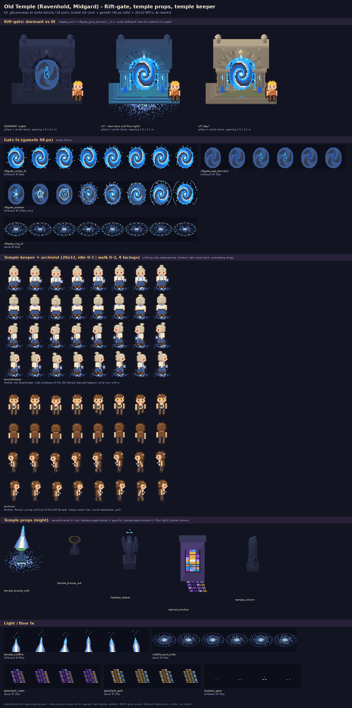

# Old Temple pack (Ravenhold, Midgard): the Rift-gate, temple props, temple keeper

Art seat staging pack for **Hearthmoor** (Bill's HD-2D game). Generated procedurally by `src/gen_old_temple.py`
(Python + Pillow + numpy, importing the repo's own `tools/sprite`, `tools/kit`, `tools/check-sprite` read-only).
Matches DESIGN_EXPANSION E6.3: white temple stone gone grey, faceless angel statues, **blue cold-fire braziers**,
stained glass throwing violet and gold at dusk, the **Rift-gate** in the inner court (quests *The Cold Altar*,
*The Faceless Statues*, *Keeper of the Gate*).

## What's here

| part | files | format (drop-in) |
|---|---|---|
| NPCs | `sprite/old_temple_actors.png/.json`, `sprite/strips/<role>.png` | exact `hd2d sprite` atlas: 20x32, pivot [10,32], rows down/up/left/right, idle 0-3 (3 fps, loop 0,1,2,1) / walk 4-7 (8 fps). **check-sprite: PASS** |
| gamefx | `gamefx/old_temple_fx.png/.json`, `gamefx/strips/*.png` | exact `hd2d portal` gamefx JSON (48 px cells, row per effect, fps / loop / kind / pivot / lift / glow / light) |
| kit | `kit/*.glb`, `kit/kit.json` + `src/kit_old_temple.py` | built with the repo's kit.py / meshlib (`pieces(K)` module like kit_harbor.py); markers, blockers, sizes in kit.json |
| previews | `renders/*.png` | 1x renders at sprite density (18 px/m), night + day |

### NPCs (`named` roles, so they only build when a spec names them)
- `templekeeper`: **Mother Ilse Brightwater**, high priestess / temple keeper. Silver bun with a cold-fire hair gem,
  cream blouse with a sky collar and pale-blue stole, **dark belt**, deep-blue skirt, brown shoes, carries the sacred
  cold-fire lantern (`bluelantern`). Light: neon blue `#2ab4ff`, intensity 0.9, range 2.2 m, pool `coldfire_pool_wide`
  (a light zone, like Sefa's lantern but softer).
- `archivist` (bonus): **Brother Tamsin**: messy brown hair, spectacles, quill, cream shirt + brown vest, dark belt, grey
  trousers, brown shoes, records under the arm.
- Clothing rule: separate top and bottom in different values, a 1 px darker waist band, leg split / skirt, shoes in
  their own colour. Biome palette only (cozy-village), <= 20 colours, 1 px ink outline, hard alpha.

### The Rift-gate (two states)
Place `riftgate_arch` and ONE glow piece at the same pos / rot (the realm_arch + realm_glow pattern from Bifrost):

| state | kit glow piece | billboard (at `markers.rift` = [0, 0.40, 0]) | light |
|---|---|---|---|
| dormant (Act 1 until *Keeper of the Gate*) | `riftgate_glow_dormant`: cooled stone runes, 4 faint cold embers | `riftgate_seal_dormant` (6f, 3 fps): slate-blue sleeping swirl + a lantern-shaped lock rune (Grandpa Alder's lantern charm) with a slow heartbeat | `#2a6cb0`, fixed 0.12, range 2.5 |
| transition | - | `riftgate_awaken` (8f, 10 fps, once): lock flares, rings race out, spiral spins up | `#a6ecff` flash curve, range 9 |
| lit | `riftgate_glow_lit`: neon-blue cold-fire rune rim, pillar runes, keystone crystal, plinth sigil, two cold-fire tongues | `riftgate_vortex_lit` (8f, 8 fps): neon-blue cold-fire spiral, burning rim, the 7 Rainbow-Rift glints orbiting | `#2ab4ff`, fixed 0.8, range 7 (3 lamp markers) |

Plus `riftgate_ring_lit` (decal, 8f): cold-fire pool + turning rune ring on the plinth in front of the lit gate.
Gate: 5.2 x 5.41 x 2.4 m, plinth top y 0.40, opening 1.9 x 3.1 m (a 48 px billboard = 2.67 m fits); blockers on the two
pillars only, so you walk through. Hero for scale on the sheet.

### Props (kit)
`temple_brazier_cold` (lamp `#2ab4ff`, range 5.5; add `temple_coldfire` billboard at y 1.10 + `coldfire_pool_wide`
decal; light zone ~2.4 m), `temple_brazier_out` (*The Cold Altar* state: ash + one ember), `faceless_statue` (2.65 m,
smooth faceless mask with a gold brow rim, folded wings; night fx `faceless_gaze` at lift 2.05; rotate toward the gate at
night for *The Faceless Statues*), `stained_window` (violet / gold / blue self-lit glass, violet lamp 0.35; dusk floor
decals `glasslight_violet` / `glasslight_gold` 1.8 m in front), `temple_column` (broken, mossy).

### Glow rules kept
Glow is emissive pixels + small lights + dithered pools only (no bloom). Off-palette colours appear only on glow
pixels: NEON blue `#2ab4ff/#a6ecff/#1c62d8`, cold fire `#5ab4f0/#d8f4ff/#2a6cb0`, violet `#a45cf0/#d4a8ff/#6a34b8`
(the same hexes as tools/portal + kit_bifrost). Sprites are biome-palette only.

**Neon flag (2026-10-05):** NPC sprites (`templekeeper`, `archivist`) use **no** neon pixels (biome palette, check-sprite PASS). Neon appears only in `gamefx/old_temple_fx.png` (all effects) and on the kit `glow` material of `riftgate_glow_lit`, `riftgate_glow_dormant`, `temple_brazier_cold`, `stained_window`.

## Drop-in steps (for the lead)
1. NPCs: either copy the role specs from `NPCS` in `src/gen_old_temple.py` into `tools/sprite/roles_more.py` (they use
   only existing spec keys; the stole / hair gem / quill are the small `*_extra` hooks), or paste the atlas rows.
2. gamefx: append the effect functions to `tools/portal/portal.py` (`EFFECTS` entries: same fps / kind / pivot / lift
   as `gamefx/old_temple_fx.json`), or merge rows into an area's gamefx atlas (cell 48 matches).
3. kit: copy `src/kit_old_temple.py` into `tools/kit/` and add the two-line import at the bottom of kit.py (see the
   module docstring). Area spec props: `{"piece": "riftgate_arch", ...}` + `{"piece": "riftgate_glow_lit", ...}` at
   the same pos, and a `glow` light per the table.
4. Regenerate: `python3 src/gen_old_temple.py` (needs /workspace/hd2d-suite; writes only into this folder).

## Files

| file | size | px |
|---|---|---|
| `contact_sheet.png` | 156 KB | 1400x2808 |
| `gamefx/old_temple_fx.json` | 9 KB |  |
| `gamefx/old_temple_fx.png` | 21 KB | 384x432 |
| `gamefx/strips/coldfire_pool_wide.png` | 2 KB | 288x48 |
| `gamefx/strips/faceless_gaze.png` | 1 KB | 192x48 |
| `gamefx/strips/glasslight_gold.png` | 1 KB | 192x48 |
| `gamefx/strips/glasslight_violet.png` | 1 KB | 192x48 |
| `gamefx/strips/riftgate_awaken.png` | 7 KB | 384x48 |
| `gamefx/strips/riftgate_ring_lit.png` | 3 KB | 384x48 |
| `gamefx/strips/riftgate_seal_dormant.png` | 3 KB | 288x48 |
| `gamefx/strips/riftgate_vortex_lit.png` | 6 KB | 384x48 |
| `gamefx/strips/temple_coldfire.png` | 1 KB | 288x48 |
| `kit/faceless_statue.glb` | 80 KB |  |
| `kit/kit.json` | 5 KB |  |
| `kit/riftgate_arch.glb` | 179 KB |  |
| `kit/riftgate_glow_dormant.glb` | 121 KB |  |
| `kit/riftgate_glow_lit.glb` | 118 KB |  |
| `kit/stained_window.glb` | 71 KB |  |
| `kit/temple_brazier_cold.glb` | 40 KB |  |
| `kit/temple_brazier_out.glb` | 36 KB |  |
| `kit/temple_column.glb` | 58 KB |  |
| `renders/faceless_statue_night.png` | 1 KB | 36x57 |
| `renders/riftgate_dormant_day.png` | 4 KB | 114x129 |
| `renders/riftgate_dormant_night.png` | 4 KB | 114x129 |
| `renders/riftgate_lit_day.png` | 5 KB | 114x129 |
| `renders/riftgate_lit_night.png` | 5 KB | 114x129 |
| `renders/stained_window_night.png` | 1 KB | 48x73 |
| `renders/temple_brazier_cold_night.png` | 1 KB | 30x48 |
| `renders/temple_brazier_out_night.png` | 1 KB | 30x38 |
| `renders/temple_column_night.png` | 1 KB | 30x60 |
| `sprite/old_temple_actors.json` | 16 KB |  |
| `sprite/old_temple_actors.png` | 8 KB | 240x256 |
| `sprite/strips/archivist.png` | 4 KB | 240x128 |
| `sprite/strips/templekeeper.png` | 5 KB | 240x128 |
| `src/gen_old_temple.py` | 28 KB |  |
| `src/hmart.py` | 30 KB |  |
| `src/kit_old_temple.py` | 18 KB |  |
