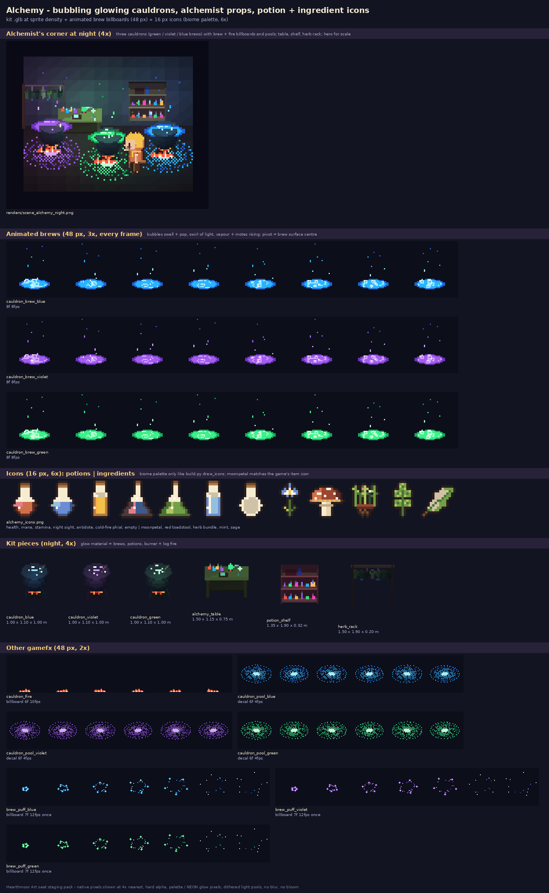

# Alchemy pack: bubbling glowing cauldrons, alchemist props, potion + ingredient icons

Art seat staging pack for **Hearthmoor**. Generated by `src/gen_alchemy.py` (Python + Pillow + numpy, importing the
repo's tools read-only). Gloom and glow: dark iron pots and timber, lit only by neon brews and little fires.

## Kit (`kit/*.glb`, `kit/kit.json`, `src/kit_alchemy.py`)
| piece | size (m) | glow / light |
|---|---|---|
| `cauldron_blue` / `cauldron_violet` / `cauldron_green` | 1.0 x 1.1 x 1.0 | brew surface (neon) + log fire; lamp in the brew colour, fixed 0.55 / 4.5 m; brew surface at [0, 0.98, 0] |
| `alchemy_table` | 1.5 x 1.15 x 0.75 | glowing flasks, green alembic, spirit-burner flame; lamp green 0.3 / 3 m |
| `potion_shelf` | 1.35 x 1.9 x 0.32 | two rows of glowing bottles (red / blue / gold / violet / green / pink); lamp violet 0.25 / 2.5 m |
| `herb_rack` | 1.5 x 1.9 x 0.2 | - (drying herb bundles + moonpetals) |

## gamefx (`gamefx/alchemy_fx.png/.json`, 48 px)
- `cauldron_brew_blue/violet/green` (8f, 8 fps, pivot [24,36] = surface centre, lift 0.98): **the animated bubbling
  brew**: swirling neon surface sized to the pot mouth at the locked camera (26 x 9 px), bubbles swelling and popping,
  vapour and motes rising. Light 0.9 / 4.5 m in the brew colour.
- `cauldron_fire` (under any pot), `cauldron_pool_<c>` (decals), `brew_puff_<c>` (once, crafting success).

## Icons (`icons/alchemy_icons.png/.json`, 16 px strip + 6x preview)
Potions: `potion_health` (Heartroot Tonic), `potion_mana` (Moonwell Draught), `potion_stamina` (Hearthfire Brew),
`potion_nightsight` (Owl-Eye Elixir), `potion_antidote` (Mossbalm), `potion_coldfire` (Cold-Fire Phial), `bottle_empty`.
Ingredients: `ing_moonpetal` (same look as the game's moonpetal item), `ing_red_toadstool` (red, white spots, warm
gills), `ing_herb_bundle`, `ing_mint`, `ing_sage` (garden herbs). Names are suggestions in the JSON.

## Neon flag
- **No neon:** the icons (biome palette only, HUD rule; the "glow" is a white glint).
- **Neon:** all gamefx; kit `glow` material on brews, bottles, burner flame, coals.

## Drop-in steps
1. Kit: copy `src/kit_alchemy.py` to `tools/kit/` + the import line from its docstring.
2. gamefx: merge `alchemy_fx` into the area atlas (cell 48) or copy `src/alchemy_fx.py` into tools/portal.
3. Icons: append to the item sheet (same 16 px cell as `art/items.png`).
4. Regenerate: `python3 src/gen_alchemy.py`.

## Files

| file | size | px |
|---|---|---|
| `READY.txt` | 1 KB |  |
| `contact_sheet.png` | 122 KB | 1400x2274 |
| `gamefx/alchemy_fx.json` | 10 KB |  |
| `gamefx/alchemy_fx.png` | 9 KB | 384x480 |
| `gamefx/strips/brew_puff_blue.png` | 1 KB | 336x48 |
| `gamefx/strips/brew_puff_green.png` | 1 KB | 336x48 |
| `gamefx/strips/brew_puff_violet.png` | 1 KB | 336x48 |
| `gamefx/strips/cauldron_brew_blue.png` | 2 KB | 384x48 |
| `gamefx/strips/cauldron_brew_green.png` | 2 KB | 384x48 |
| `gamefx/strips/cauldron_brew_violet.png` | 2 KB | 384x48 |
| `gamefx/strips/cauldron_fire.png` | 1 KB | 288x48 |
| `gamefx/strips/cauldron_pool_blue.png` | 2 KB | 288x48 |
| `gamefx/strips/cauldron_pool_green.png` | 2 KB | 288x48 |
| `gamefx/strips/cauldron_pool_violet.png` | 2 KB | 288x48 |
| `icons/alchemy_icons.json` | 2 KB |  |
| `icons/alchemy_icons.png` | 2 KB | 192x16 |
| `icons/alchemy_icons_6x.png` | 3 KB | 1152x96 |
| `kit/alchemy_table.glb` | 102 KB |  |
| `kit/cauldron_blue.glb` | 110 KB |  |
| `kit/cauldron_green.glb` | 110 KB |  |
| `kit/cauldron_violet.glb` | 110 KB |  |
| `kit/herb_rack.glb` | 72 KB |  |
| `kit/kit.json` | 4 KB |  |
| `kit/potion_shelf.glb` | 152 KB |  |
| `renders/alchemy_table_night.png` | 1 KB | 40x34 |
| `renders/cauldron_blue_night.png` | 1 KB | 32x36 |
| `renders/cauldron_green_night.png` | 1 KB | 32x36 |
| `renders/cauldron_violet_night.png` | 1 KB | 32x36 |
| `renders/herb_rack_night.png` | 1 KB | 40x42 |
| `renders/potion_shelf_night.png` | 1 KB | 38x38 |
| `renders/scene_alchemy_night.png` | 9 KB | 129x107 |
| `src/alchemy_fx.py` | 6 KB |  |
| `src/alchemy_icons.py` | 7 KB |  |
| `src/gen_alchemy.py` | 9 KB |  |
| `src/hmart.py` | 32 KB |  |
| `src/kit_alchemy.py` | 9 KB |  |
