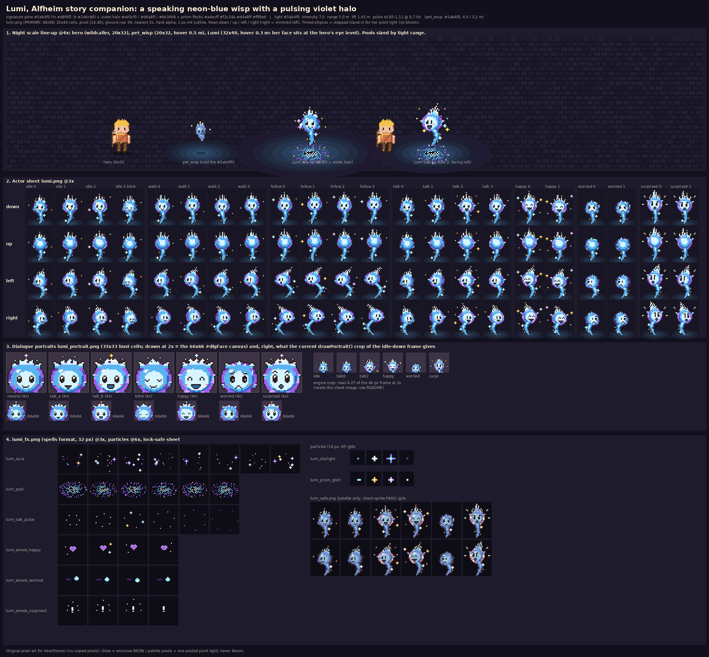

# Lumi: the Alfheim story companion (a speaking wisp)

Art seat staging piece for **Hearthmoor**. Generated by `lumi_gen.py` (Python + Pillow, self-contained, byte-identical
reruns: `python3 -B lumi_gen.py`). It reads two files only to put them on the contact sheet for scale: the wildcaller from
`games/hearthmoor/areas/plaza/public/art/sprite/actors.png` and pet_wisp from `../../pets/pets_neon.png`. The repo is not touched.

**Story source:** `docs/story/` has no `alfheim.md` and no section 5.5. The only Lumi line is in HEARTHMOOR_BUILDER_HANDOFF
("Alfheim **Lumi** (wisp spirit)"). Alfheim = light elves, wisps, prism light, Lumenvale, Wisp Night, violet neon.
So she is drawn as Bill asked: a glowing wisp that talks, not an elf.

## Look
Lumi has a **neon-blue cold-fire core** with a **pulsing violet halo** (alfheim.md 5.5, as relayed by the lead). Her features:
- a 14 px glowing orb with a near-white-cyan face that brightens as she talks
- a violet halo ring that hugs the orb and pulses: a dim broken ring at rest, solid violet mid-pulse, violet with lilac beads at the peak (talk column 14, happy, surprised)
- big 2x3 ink eyes with white glints, rose cheeks and a mouth that animates
- a five-tongue cold-fire **crown** whose tips throw **prism flecks** (starlight aqua, gold, lilac, white)
- little flame **hands** and a curling **starry tail**

Her size (orb 14x13 px vs the pet's 9x8), the violet halo and the prism flecks set her apart from the small kit wisp (pet_wisp, palette blues, 20x32). Her near-white-cyan face also makes her read brighter, and her light is 7.0 / 5.0 m against the pet's 4.0 / 3.2 m.

### Colours
| part | hex |
|---|---|
| core (body / highlight / shade) | **#5ab4f0** / **#d8f4ff** / **#2a6cb0** (the cold-fire family: the kit's cold / cold_hi / cold_lo) |
| halo (violet / lilac / deep) | **#a45cf0** / **#d4a8ff** / **#6a34b8** (spells.py neon violet) |
| prism flecks | #a6ecff #f2c24a #d4a8ff #fff8e6 |
| face | ink #2a1e1c eyes, white glints, rose #e47c8c cheeks |

All the colour choices sit in `SLOTS_NEON` / `SLOTS_SAFE` and `ROLE["light"]` in `lumi_gen.py`. The safe twin uses flower_blue / sky / cloth for the core and a rose / plaster / shadow halo.

## Files
| file | what |
|---|---|
| `lumi.png` + `lumi.json` | **PRIMARY** actor sheet (NEON pixels), 704x160 |
| `lumi_safe.png` + `lumi_safe.json` | lock-safe palette-only twin (rose / plaster / roof); **check-sprite PASS** (`check_sprite_report.json`) |
| `actors_stub.json` | the `sheets` + stub `roles` entries to merge into an area `actors.json` (same pattern as the pets sheet) |
| `lumi_portrait.png` / `_2x.png` / `_safe.png` + `lumi_portrait.json` | dialogue portraits: 7 bust cells, 33x33 (2x = 66x66) |
| `lumi_fx.png` + `lumi_fx.json` | tools/spells format, 32 px cells: `lumi_aura`, `lumi_pool`, `lumi_talk_pulse`, `lumi_emote_happy / _worried / _surprised` |
| `lumi_particles.png` + `lumi_particles.json` | tools/particles format, 16 px cells: `lumi_starlight` (tail motes), `lumi_prism_glint` (crown) |
| `lumi_light.json` | light params (plus pet_wisp for comparison) |
| `strips/lumi_<anim>.png` | one strip per anim (4 facings) |
| `contact_sheet.png` | night line-up (hero, pet_wisp, Lumi idle, Lumi talking), the full sheet at 3x, portraits plus the engine-crop preview, fx, particles, lock-safe |
| `lumi_gen.py` | the generator |

## Actor sheet
- **Cell 32x40, pivot [16,40], ground row 39.** Rows: down / up / left / right (right = mirrored left). Hard alpha, 1 px ink #2a1e1c outline.
- **Why 32x40 and not the hero's 20x32:** her orb, crown, raised hands, sparkles and starry tail need about 30 px of width in the side and emote poses, and about 38 px of height when the crown flares (surprised). A 24x32 cell would clip her or make her smaller than a speaking character should read.
- 40 px tall keeps the same pixel density as the hero (the engine's `tall = S.fh / 32` = 1.25), so her shadow and height scale correctly. It is the same mechanism as the boss and pets sheets.
- She is drawn standing on her tail tip. With `hover.lift` 0.3 m her face sits at the hero's eye level (orb centre about 1.5 m).

| anim | columns | fps | notes |
|---|---|---|---|
| idle | 0-3 | 3 | float bob, glow breath, frame 3 = blink (loop [0,1,2,1]) |
| walk | 4-7 | 8 | float drift, hands trailing |
| follow | 8-11 | 10 | catch-up stream: crown swept back, "wheee" mouth, star trail |
| talk | 12-15 | 8 | mouth closed / small / wide / small, face + crown **glow pulse** (peak at col 14), hands gesture; loop [0,1,2,1,0,3,2,1] |
| happy | 16-17 | 4 | ^^ eyes, grin, hands up, bounce, tall crown, stars |
| worried | 18-19 | 5 | slanted brows, watery eyes, frown, hands tucked, short dim crown, starlight sweat drop, tremble |
| surprised | 20-21 | 6 | wide eyes, raised brows, O mouth, crown flares, burst lines; loop [0,1,1,1] / hold 1 |

The engine already merges a sheet's own `anims` (sprites.js: `anims: { ...meta.anims, ...(m.anims || {}) }`), so `lumi.json`'s anims work without editing the area's main anims. `frameOrigin` uses `a.frame` within each anim's `start`. The 2-frame emotes are fine.

## Light (`lumi_light.json`, same schema as `game/pets.js`, plus `halo`)
`{ color: '#5ab4f0', intensity: 7.0, range: 5.0, lift: 1.45, pulse: [0.85, 1.12, 0.7], r: 3.0, fadeIn: 0.5 }`
(pet_wisp is `#5ab4f0, 4.0, 3.2, lift 0.75`; Lumi is the same hue but almost twice as bright, and the violet halo sets her apart)
- **halo** `{ color: '#a45cf0', mode: 'tint_pulse', mix: [0, 0.35], hz: 0.7, sync: 'pulse' }`: lerp the core light toward violet in step with the intensity pulse (peak = 35% violet). Use the full mix on talk column 14, happy and surprised.
  - Optional `second_light` `#a45cf0`, 2.5 / 6.5 m, pulse [0.4, 1.0, 0.7]: only where the 2-3 light cap allows (cutscenes, Wisp Night).
- **talk_pulse** ×[1.0, 1.12, 1.3, 1.15] on talk columns 12-15. **emote:** happy ×1.25, worried ×0.7, surprised ×1.45.
- **prism_shift** (optional): cycles #5ab4f0, #a6ecff, #d4a8ff, #ffd27a, 25% mix over 6 s.
- She uses one pooled light by default; the halo is a tint on that light, not a second light. No bloom.

## FX and particles
| name | kind | frames / fps | use |
|---|---|---|---|
| `lumi_aura` (violet halo ring + prism flecks) | billboard, pivot [16,31], `follow_lift: hover` | 8 / 8 loop | always on at night / in dim areas |
| `lumi_pool` (blue heart, violet edge) | decal (pre-squashed sin 36°), pivot [16,16] | 6 / 5 loop | under her; rx 14.5 px (pet_wisp's is 10.5) |
| `lumi_talk_pulse` | billboard, lift 1.15 + hover | 6 / 8 loop | while a dialogue page is typing |
| `lumi_emote_happy / worried / surprised` | billboard over the crown, lift 1.75 + hover | 4, once | pop with the matching emote anim |
| `lumi_starlight` (particle row 0) | 5 / s, life 0.8-1.5 s | | spawn along the tail (lift 0.3-1.1 m) |
| `lumi_prism_glint` (particle row 1) | 2.5 / s | | spawn at the crown; double while talking |

## Dialogue portrait
- The game has **no portrait files**. `game.js drawPortrait()` crops the NPC's idle-down frame (column 0) from the *area atlas image* to the bottom 22 rows (`sy = fy + fh - 34`) and draws it integer-scaled into the 66x66 `#dlgFace`.
- For Lumi's 40 px frame that crop is rows 6-27 at 2x: crown and face, which is fine (preview on the contact sheet).
- **But:** `drawPortrait` always reads `portraitImg` (the area's main atlas) at x = 0. For a role on its own sheet (Lumi, the pets) it would read the wrong image. The Builder has two choices:
  - **(a)** Use `lumi_portrait.png`: 33x33 bust cells drawn at 2x = exactly 66x66. Cells: neutral, talk_a, talk_b, blink, happy, worried, surprised. `lumi_portrait.json` gives a talk loop `[talk_a, talk_b, talk_a, neutral]` @ 8 fps, a blink every 2.5-5 s and a mood map. This is the recommended choice: a bigger face with real expressions.
  - **(b)** Make `drawPortrait` read `npc.a.S.path` image for sheet roles.

## Integration notes for the Builder
1. Copy `lumi.png` + `lumi.json` into the Alfheim area's `public/art/sprite/` and merge `actors_stub.json` into its `actors.json`.
2. Spawn her with `behavior: 'follow'`, `a.lift = 0.3 + sin(t * 2π * 0.7) * 0.08`, speed 2.6.
3. Use the light above via `ctx.addGlow`. Use `lumi_fx.json` / `lumi_particles.json` with the spells / particles loaders, the same way the pets do.
4. In dialogue: face her toward the hero, play `talk` while a page types, then the mood's emote anim + emote fx on tagged lines.
5. check-sprite: `lumi_safe.png` PASSES. `lumi.png` fails **only** on the NEON colours (#5ab4f0 / #d8f4ff / #2a6cb0 / #a45cf0 / #d4a8ff / #6a34b8 / #a6ecff); there are no structural issues. To pass, it needs a scoped `lumi` entry in `NEON_PETS_ALLOW` like the pets have (a repo edit, which is the Builder's call).

Original pixel art for Hearthmoor (no copied pixels).
