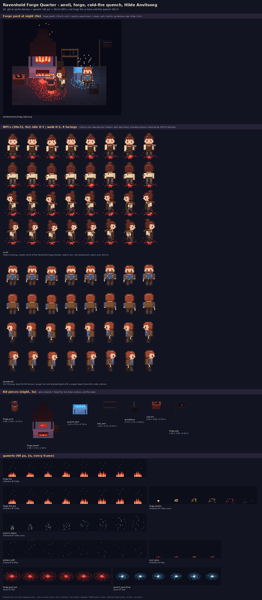

# Forge pack: Ravenhold Forge Quarter (anvil, forge, quench, master smith)

Art seat staging pack for **Hearthmoor**. Generated by `src/gen_forge.py` (Python + Pillow + numpy, importing the repo's
tools read-only). Follows DESIGN_EXPANSION E6.2: **red forge mouths** and **blue cold-fire quench tanks** (gloom and
glow: red neon vs neon-blue cold fire in one dark yard), master smith **Hilde Anvilsong**.

## NPCs (`sprite/forge_actors.png/.json`, check-sprite PASS)
`hd2d sprite` atlas: 20x32, pivot [10,32], rows down / up / left / right, idle 0-3 (3 fps, loop 0,1,2,1) and walk 4-7
(8 fps), `named` roles.
- `smith`: **Hilde Anvilsong**, master smith. Auburn bun, red neckerchief, cream work shirt under a brown leather apron,
  **dark belt at the waist**, slate trousers, black boots (contrasting), smith's hammer, a soot smudge. Normal work
  clothes: separate top and bottom, visible waist.
- `dwarfsmith` (bonus): **Orri Flintcog**, dwarf smith (rune-chisel in hand, added 2026-10-06; not tongs, since his crossed-cog tongs are the stolen frame-up tongs in forge_alchemy.md 5.4): ginger hair + braided beard with a copper bead, blue shirt,
  brown vest, dark belt, brown trousers, black boots, hands free. (Uses the `broad` layout; the game has no short-adult
  layout yet.)

## Kit (`kit/*.glb`, `kit/kit.json`, `src/kit_forge.py`)
| piece | size (m) | glow / light |
|---|---|---|
| `forge_anvil` | 0.90 x 0.95 x 0.75 | red-hot bar on the face; lamp `#ff5a4a` 0.25 / 2 m |
| `forge_hearth` | 3.2 x 3.7 x 1.4 | red mouth with coals + top fire bed; lamp `#ff5a4a` fixed 0.6 / 6 m; mouth at [0, 0.27, 0.72], chimney top [0, 3.66, -0.1] |
| `quench_tank` | 1.45 x 0.70 x 0.76 | neon-blue cold-fire water; lamp `#5ab4f0` 0.45 / 4 m |
| `tool_rack` | 1.3 x 1.7 x 0.2 | - |
| `grindstone` | 0.75 x 1.1 x 0.6 | - |
| `coal_bin` | 0.84 x 0.66 x 0.59 | three live embers; lamp `#e0302a` 0.1 / 1.2 m |
| `forge_sign` | 1.0 x 2.6 x 0.2 | anvil emblem with a glowing hot bar |

## gamefx (`gamefx/forge_fx.png/.json`, 48 px)
`forge_fire` (mouth, light red 1.4 / 6 m), `forge_fire_top`, `forge_sparks` (once, anvil strike; fire every ~1.2 s while
Hilde works), `quench_steam` (once, white steam + cold-fire sparks), `embers_drift`, `anvil_glow`, `forge_pool_red` and
`quench_pool_blue` (decals). Placement per piece is in `kit.json` (`fx`, `mouth`, `chimney_top`, NPC spot).

## Neon flag
- **No neon:** the NPC sprites (biome palette only).
- **Neon:** all gamefx; kit `glow` material on the forge fire / coals, hot bar, embers, sign bar, cold-fire water.

## Drop-in steps
1. NPCs: copy the specs in `NPCS` (`src/gen_forge.py`) into `tools/sprite/roles_more.py` (existing spec keys + tiny
   `*_extra` hooks) or paste the atlas rows.
2. Kit: copy `src/kit_forge.py` to `tools/kit/` + the import line from its docstring.
3. gamefx: merge `forge_fx` into the Ravenhold gamefx atlas or copy the functions into tools/portal.
4. Regenerate: `python3 src/gen_forge.py`.

## Files

| file | size | px |
|---|---|---|
| `READY.txt` | 1 KB |  |
| `contact_sheet.png` | 133 KB | 1400x3194 |
| `gamefx/forge_fx.json` | 8 KB |  |
| `gamefx/forge_fx.png` | 6 KB | 384x384 |
| `gamefx/strips/anvil_glow.png` | 1 KB | 192x48 |
| `gamefx/strips/embers_drift.png` | 1 KB | 384x48 |
| `gamefx/strips/forge_fire.png` | 2 KB | 384x48 |
| `gamefx/strips/forge_fire_top.png` | 2 KB | 384x48 |
| `gamefx/strips/forge_pool_red.png` | 2 KB | 288x48 |
| `gamefx/strips/forge_sparks.png` | 1 KB | 288x48 |
| `gamefx/strips/quench_pool_blue.png` | 1 KB | 288x48 |
| `gamefx/strips/quench_steam.png` | 1 KB | 384x48 |
| `kit/coal_bin.glb` | 53 KB |  |
| `kit/forge_anvil.glb` | 31 KB |  |
| `kit/forge_hearth.glb` | 80 KB |  |
| `kit/forge_sign.glb` | 24 KB |  |
| `kit/grindstone.glb` | 27 KB |  |
| `kit/kit.json` | 4 KB |  |
| `kit/quench_tank.glb` | 31 KB |  |
| `kit/tool_rack.glb` | 30 KB |  |
| `renders/coal_bin_night.png` | 1 KB | 28x27 |
| `renders/forge_anvil_night.png` | 1 KB | 30x31 |
| `renders/forge_hearth_night.png` | 1 KB | 59x78 |
| `renders/forge_sign_night.png` | 1 KB | 31x52 |
| `renders/grindstone_night.png` | 1 KB | 26x32 |
| `renders/quench_tank_night.png` | 1 KB | 41x36 |
| `renders/scene_forge_night.png` | 8 KB | 158x127 |
| `renders/tool_rack_night.png` | 1 KB | 36x39 |
| `sprite/forge_actors.json` | 15 KB |  |
| `sprite/forge_actors.png` | 8 KB | 240x256 |
| `sprite/strips/dwarfsmith.png` | 4 KB | 240x128 |
| `sprite/strips/smith.png` | 5 KB | 240x128 |
| `src/forge_fx.py` | 6 KB |  |
| `src/gen_forge.py` | 13 KB |  |
| `src/hmart.py` | 32 KB |  |
| `src/kit_forge.py` | 12 KB |  |
