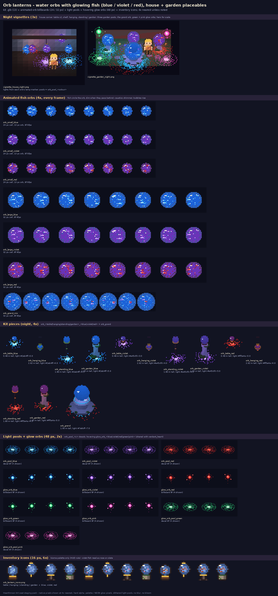

# Orb lanterns pack: water orbs with glowing fish (house + garden placeables)

Art seat staging pack for **Hearthmoor**. Generated by `src/gen_orb_lanterns.py` (Python + Pillow + numpy, importing
the repo's tools read-only). Bill's ask: **orb lanterns full of water with glowing fish**, in **blue, violet and red**,
placeable in a house or garden; plus his **hovering glow orbs** (blue / violet / red / green / pink) as ambient lights.
Built on the harbor `fish_orb` idea (orb on a stand, glowing water, little fish), redrawn as a full placeable family.

## Kit (`kit/*.glb`, `kit/kit.json`, `src/kit_orb_lanterns.py`) - 13 pieces
| mount | pieces | size | where | light (lamp marker) |
|---|---|---|---|---|
| table | `orb_table_blue/violet/red` | 0.36 x 0.48 m (0.34 m orb) | table, shelf, windowsill | fixed 0.4, range 3 m |
| hanging | `orb_hanging_*` | hook at 2.6 m, orb centre 1.75 m (0.40 m orb) | ceiling beam / porch eave; no blocker | 0.45, 4 m |
| standing | `orb_standing_*` | 1.8 m (0.46 m orb) | house corner, porch | 0.45, 4.5 m |
| garden | `orb_garden_*` | 1.65 m stone post (0.60 m orb) | garden, path, plaza | 0.5, 5 m |
| showpiece | `orb_grand` | 1.95 m, 1.1 m orb, all three fish colours | garden centre / plaza | `#7a8cff`, 0.6, 7 m |

Light / pool colours per fish colour (in `kit.json` per piece: `light.color`, `light.pool_colors`):

| colour | lamp | pool hi / mid / lo | water tint |
|---|---|---|---|
| blue | `#2ab4ff` | `#a6ecff / #2ab4ff / #1c62d8` | deep blue `#123c6c` |
| violet | `#a45cf0` | `#d4a8ff / #a45cf0 / #6a34b8` | deep indigo `#2a1e5c` |
| red | `#ff5a4a` | `#ff5a4a / #e0302a / #a81c22` | deep plum `#3a1a3a` |

Each piece's `kit.json` entry also names its animated billboard (`fx`), pool decal (`pool`), placement hint and the
inventory icon id, and is flagged `placeable: true` for the house / garden decorating system.

## gamefx (`gamefx/`)
| atlas | cell | effects |
|---|---|---|
| `orb_fx_24` | 24 | `orb_small_blue/violet/red`: a whole 13 px orb (water, caustics, 2 fish circling - dim when behind - bubbles, glass glint). 8f, 6 fps, pivot [12,12] = orb centre |
| `orb_fx_32` | 32 | `orb_large_*` (21 px orb, 3 fish) for garden posts; `orb_grand_mix` (30 px orb, 5 fish in all colours) |
| `orb_fx_48` | 48 | `orb_pool_blue/violet/red` (decals), `glow_orb_blue/violet/red/green/pink` (hovering orb billboards, lift 1.1, light 0.8 / 4 m), `glow_orb_pool_green/pink` |

Anchor an orb billboard at the piece's lamp marker (orb centre); it covers the kit orb exactly and animates the fish.
Glow orbs: float one or two per garden / room (they're the same art as verdant_heart's, from the shared lib).

## Icons (`icons/orb_lantern_icons.png/.json`, 16 px + 6x preview)
12 inventory icons (`orb_<mount>_<colour>`), biome palette only like `build.py draw_icons` (violet fish read as rose
on slate, since the HUD palette has no violet).

## Neon flag
- **Uses neon:** all gamefx (orbs, fish, pools, glow orbs) and the kit `glow` material on the water + fish.
- **No neon:** the inventory icons (biome palette), and every non-glow kit material (wood, iron, brass, stone, moss).

## Drop-in steps
1. Copy `src/kit_orb_lanterns.py` to `tools/kit/` and add the import line from its docstring; place pieces by name.
2. Merge the three gamefx atlases into the house / garden gamefx (or copy `src/orb_fx.py` functions into tools/portal).
3. Add the icons to the item sheet and map `item_icon` -> piece for the placement system.
4. Regenerate: `python3 src/gen_orb_lanterns.py`.

## Files

| file | size | px |
|---|---|---|
| `READY.txt` | 1 KB |  |
| `contact_sheet.png` | 183 KB | 1400x2998 |
| `gamefx/orb_fx_24.json` | 4 KB |  |
| `gamefx/orb_fx_24.png` | 4 KB | 192x72 |
| `gamefx/orb_fx_32.json` | 5 KB |  |
| `gamefx/orb_fx_32.png` | 8 KB | 256x128 |
| `gamefx/orb_fx_48.json` | 10 KB |  |
| `gamefx/orb_fx_48.png` | 10 KB | 384x480 |
| `gamefx/strips/glow_orb_blue.png` | 2 KB | 384x48 |
| `gamefx/strips/glow_orb_green.png` | 2 KB | 384x48 |
| `gamefx/strips/glow_orb_pink.png` | 2 KB | 384x48 |
| `gamefx/strips/glow_orb_pool_green.png` | 1 KB | 288x48 |
| `gamefx/strips/glow_orb_pool_pink.png` | 1 KB | 288x48 |
| `gamefx/strips/glow_orb_red.png` | 2 KB | 384x48 |
| `gamefx/strips/glow_orb_violet.png` | 2 KB | 384x48 |
| `gamefx/strips/orb_grand_mix.png` | 3 KB | 256x32 |
| `gamefx/strips/orb_large_blue.png` | 2 KB | 256x32 |
| `gamefx/strips/orb_large_red.png` | 2 KB | 256x32 |
| `gamefx/strips/orb_large_violet.png` | 2 KB | 256x32 |
| `gamefx/strips/orb_pool_blue.png` | 1 KB | 288x48 |
| `gamefx/strips/orb_pool_red.png` | 2 KB | 288x48 |
| `gamefx/strips/orb_pool_violet.png` | 1 KB | 288x48 |
| `gamefx/strips/orb_small_blue.png` | 2 KB | 192x24 |
| `gamefx/strips/orb_small_red.png` | 2 KB | 192x24 |
| `gamefx/strips/orb_small_violet.png` | 2 KB | 192x24 |
| `icons/orb_lantern_icons.json` | 3 KB |  |
| `icons/orb_lantern_icons.png` | 1 KB | 192x16 |
| `icons/orb_lantern_icons_6x.png` | 2 KB | 1152x96 |
| `kit/kit.json` | 10 KB |  |
| `kit/orb_garden_blue.glb` | 93 KB |  |
| `kit/orb_garden_red.glb` | 93 KB |  |
| `kit/orb_garden_violet.glb` | 93 KB |  |
| `kit/orb_grand.glb` | 143 KB |  |
| `kit/orb_hanging_blue.glb` | 119 KB |  |
| `kit/orb_hanging_red.glb` | 119 KB |  |
| `kit/orb_hanging_violet.glb` | 119 KB |  |
| `kit/orb_standing_blue.glb` | 102 KB |  |
| `kit/orb_standing_red.glb` | 102 KB |  |
| `kit/orb_standing_violet.glb` | 102 KB |  |
| `kit/orb_table_blue.glb` | 83 KB |  |
| `kit/orb_table_red.glb` | 83 KB |  |
| `kit/orb_table_violet.glb` | 84 KB |  |
| `renders/orb_garden_blue_night.png` | 1 KB | 27x41 |
| `renders/orb_garden_red_night.png` | 1 KB | 27x41 |
| `renders/orb_garden_violet_night.png` | 1 KB | 27x41 |
| `renders/orb_grand_night.png` | 2 KB | 47x51 |
| `renders/orb_hanging_blue_night.png` | 1 KB | 22x31 |
| `renders/orb_hanging_red_night.png` | 1 KB | 22x31 |
| `renders/orb_hanging_violet_night.png` | 1 KB | 22x31 |
| `renders/orb_standing_blue_night.png` | 1 KB | 22x42 |
| `renders/orb_standing_red_night.png` | 1 KB | 22x42 |
| `renders/orb_standing_violet_night.png` | 1 KB | 22x42 |
| `renders/orb_table_blue_night.png` | 1 KB | 20x22 |
| `renders/orb_table_red_night.png` | 1 KB | 20x22 |
| `renders/orb_table_violet_night.png` | 1 KB | 20x22 |
| `renders/vignette_garden_night.png` | 11 KB | 154x91 |
| `renders/vignette_house_night.png` | 7 KB | 137x108 |
| `src/gen_orb_lanterns.py` | 18 KB |  |
| `src/hmart.py` | 32 KB |  |
| `src/kit_orb_lanterns.py` | 10 KB |  |
| `src/orb_fx.py` | 6 KB |  |
