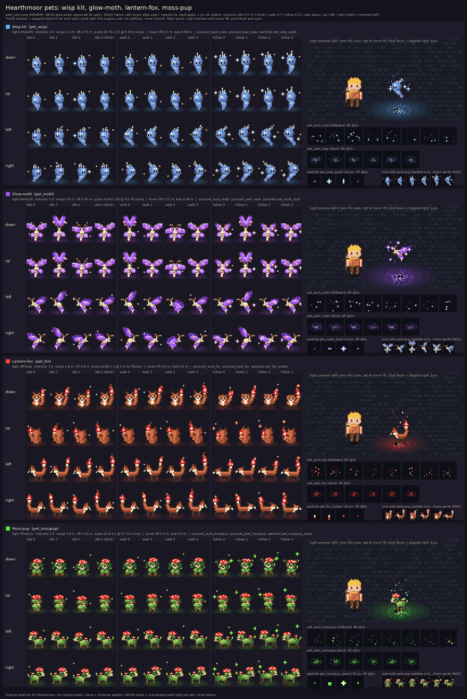

# Hearthmoor pets: wisp kit, glow-moth, lantern-fox, moss-pup

This folder has four glowing pet companions for Hearthmoor, drawn procedurally by `pets_gen.py` with Python and Pillow. All art is original and follows the cozy HD-2D style lock. The hd2d-suite repo was read but not changed.

**Primary sheet: `pets_neon.png`.** Bill approved NEON emissive pixels for pets on 2026-10-05. `pets.png` is kept as a lock-safe fallback that uses palette colours only. Both sheets share one layout and one `pets.json`.

| pet (role id) | rows | look | glow | movement |
|---|---|---|---|---|
| **Wisp kit** (`pet_wisp`) | 0–3 | a round cold-fire wisp with a 3-tongue flame crown, a curling flame tail and little ink eyes | **neon blue cold fire** | hovers at hip height |
| **Glow-moth** (`pet_moth`) | 4–7 | a fuzzy cream lantern moth with feathery antennae (glowing tips), neon-violet wings, rose eyespots and a lit abdomen tip | **violet neon** | hovers at shoulder height |
| **Lantern-fox** (`pet_fox`) | 8–11 | a small orange fox with a cream bib, dark socks and big ears; its bushy tail ends in a flickering neon-red foxfire lantern | **red neon** | trots on the ground |
| **Moss-pup** (`pet_mosspup`) | 12–15 | a round little pup of living moss with floppy leaf ears, a cream snout, brown paws, a **neon-red toadstool cap with crisp white spots** on its head, a tiny toadstool and glowing moss dots on its back, and a glowing moss-tuft tail | **toxic-lime neon green** spores (plus the red cap) | trots on the ground; its ears fly up and its cap bobs when bounding |

Story hooks (STORY_SEEDS "Pets"):
- The lantern moth lights caves and shows hidden doors.
- The wisp kit gives a neon pulse, night light and slow mana regen.
- The rift fox senses portals.
- The moss-pup (Mossbrook, Vanaheim) sniffs out herbs, mushrooms and hidden springs.

The moss-pup's colours come from Bill's mood refs in `../_refs/`: bioluminescent mushrooms, neon fireflies, and lime green against magenta and teal.

## Files

| file | what |
|---|---|
| `pets_neon.png` (240x512) | **Primary** sprite sheet: 4 rows per pet (down / up / left / right) of 12 columns. Glow pixels use the NEON accents (blue cold fire from the palette, plus violet, red and the new green). |
| `pets.png` (240x512) | Lock-safe fallback with the same layout, cozy-village palette only. Passes `hd2d check-sprite` (`check_sprite_report.json`). |
| `pets.json` | **Actor-atlas format** (same keys as `areas/*/public/art/sprite/actors.json`: `frame`, `pivot`, `ground_row`, `facings`, `anims`, `cols`, `roles[*].row / kind / anims / frames[]` with absolute pivots). `image` = `pets_neon.png` (primary) and `image_lock_safe` = `pets.png`; `neon_accents` lists the NEON hexes. Each role has a `petfx` block (hover, light, aura, pool, particles, speed). |
| `pet_wisp.png`, `pet_moth.png`, `pet_fox.png`, `pet_mosspup.png` | One strip per pet (240x128) cut from the primary NEON sheet. `pet_<id>_safe.png` are the lock-safe strips. |
| `pets_fx.png` + `pets_fx.json` | Effects in the **spells format** (32 px cells, one row per effect, entries shaped like `spells.json` `effects`). Rows 0–2: `pet_aura_wisp` / `_moth` / `_fox`. Rows 3–5: `pet_pool_wisp` / `_moth` / `_fox`. Row 6: `pet_aura_mosspup`. Row 7: `pet_pool_mosspup`. Auras are billboards with 8 frames; pools are ground decals with 6 frames, pre-squashed by sin 36°. |
| `pets_particles.png` + `pets_particles.json` | Particles in the **particles format** (16 px cells, 4 frames per row, presets shaped like `particles.json`). Rows 0–3: `pet_wisp_spark`, `pet_moth_dust`, `pet_fox_ember`, `pet_mosspup_spore`. |
| `contact_sheet.png` | Every frame of the primary sheet at 4x on a dark background, each with a stepped light-pool tint. The right-hand panel per pet is a night preview showing the hero for scale, the pet at its hover lift, the pool decal, the light and the aura. It also shows the aura, pool and particle strips and the lock-safe thumbnails. |
| `pets_gen.py` | The generator. Run `python3 pets_gen.py [--out DIR]`. It is self-contained (palette and NEON embedded) and deterministic: two runs give byte-identical PNGs. It reads the plaza atlas only to place the wildcaller on the contact sheet. |
| `check_sprite_report.json` | Output of the repo's `tools/check-sprite/check_sprite.py` on `pets.png`: **PASS** for all 4 roles, 0 failures, 0 semi-transparent px. |

Adding the moss-pup was purely additive. Rows 0–11 of both sheets, fx rows 0–5 and particle rows 0–2 are pixel-identical to the previous build, so any offsets already wired up still hold.

## Sprite spec (identical to the actor atlas)

- **Frames:** 20x32 native cells, feet pivot `[10, 32]`, ground row 31, hard alpha (0 / 255 only), 1 px `ink` outline (it also wraps every glow spark). Colour counts in `pets.png`: wisp 5, moth 12, fox 9, moss-pup 13.
- **Scale:** pets are smaller than the hero, about the cat's size. The wisp is about 9x10 px plus its flame and tail, the moth spans about 14 px, the fox is about 16x14 px plus its tail, and the moss-pup is about 13x15 px including its cap.
- **Rows (4 per pet):** `down`, `up`, `left`, `right` (`right` = mirrored `left`). This is the hero facing order. Row starts: wisp 0, moth 4, fox 8, moss-pup 12.
- **Columns:**

| anim | cols | fps | notes |
|---|---|---|---|
| `idle` | 0–3 | 3, loop `[0,1,2,1]`, `blink: 3` | same as villagers: frame 3 is the blink (eyes shut, antennae twitch) |
| `walk` | 4–7 | 8 | normal pace near the hero |
| `follow` | 8–11 | 10 | the catch-up gait: the wisp streams with its flame swept back and a spark trail, the moth glides with wings swept back, the fox gallops with ears back and tail streaming, and the moss-pup bounds with its leaf ears flying and its cap bouncing |

- **Hovering pets** (wisp, moth) are drawn *standing on the ground row*, with the flame tail or lantern abdomen tip touching row 31, so check-sprite's feet rule holds. The runtime raises the visible quad with `a.lift`, the same mechanism the hero's jump uses: the shadow caster and depth stay on the ground. Suggested values are in `petfx.hover`:
  - wisp: `lift 0.5 m`, `bob 0.06 m @ 0.8 Hz`
  - moth: `lift 0.75 m`, `bob 0.08 m @ 0.6 Hz`
  - fox and moss-pup: `0`

## NEON accents (glow pixels only)

`neon_violet*` and `neon_red*` match `tools/spells/spells.py` `NEON`. The moss-pup adds a new pet accent, **neon green**: `neon_green #5aec3c`, `neon_green_hi #c4ff8a`, `neon_green_lo #24a03a`. It is a toxic lime, clearly apart from the palette's grass greens and from the blue / violet / red signature glows. In `pets_neon.png`:
- the moth's wings use violet;
- the fox's flame uses red;
- the moss-pup's toadstool caps use red with white spots, and its moss dots, ear tips, tail tuft and spores use green.

The body fur, muzzles and paws stay in the palette.

## Light pools (ctx.addGlow + decal)

| pet | light colour | intensity | range | lift (m above ground) | pulse | ground decal | aura / particles |
|---|---|---|---|---|---|---|---|
| wisp | `#5ab4f0` (the game's cold-fire `LANTERN` / garden coldfire hex) | 4.0 | 3.2 m | 0.75 | x0.75–1.15, sine 0.9 Hz ("neon pulse") | `pet_pool_wisp` (palette sky / flower_blue / cloth) | `pet_aura_wisp`, `pet_wisp_spark` (palette) |
| moth | `#a45cf0` (NEON violet, same as garden `violet`) | 5.0 | 3.8 m (widest: lights caves) | 0.95 | x0.85–1.05, sine 0.5 Hz | `pet_pool_moth` (NEON violet) | `pet_aura_moth`, `pet_moth_dust` (NEON violet) |
| fox | `#ff4a3a` (garden `toadcap` red) | 3.5 | 2.8 m | 0.6 (tail tip) | x0.85–1.1, flicker about 5 Hz | `pet_pool_fox` (NEON red) | `pet_aura_fox`, `pet_fox_ember` (NEON red) |
| moss-pup | `#5aec3c` (NEON green) | 3.5 | 3.0 m | 0.55 (cap / back) | x0.8–1.1, sine 0.7 Hz ("breathing" spores) | `pet_pool_mosspup` (NEON green) | `pet_aura_mosspup` (rising green spores, round 2x2 puffs, the odd red cap fleck), `pet_mosspup_spore` |

These sit between a tier-II summon light (3 / 2.4 m) and a toadstool (6 / 3.6 m), so a pet never outshines lanterns. The engine has only 2–3 pooled point lights (`glowCap()`), ranked by power over distance to the camera target. A pet next to the player will usually take one, so on phones (cap 2) consider dropping the pet light while a boss light or spell flash is active. The glow comes only from emissive pixels and the pooled point light; never bloom.

## Integration notes (for the lead; nothing here is wired into the game)

1. **Sheet.** Pick one of these:
   - **(a) Own sheet, like the boss sheet.** Copy `pets_neon.png` / `pets.json` into an area's `public/art/sprite/`. In that area's `actors.json` add `"sheets": {"pets": {"json": "pets.json", "image": "pets_neon.png"}}` and stub roles such as `"pet_wisp": {"sheet": "pets", "row": 0, "kind": "creature", "anims": ["idle","walk","follow"]}` (rows 4 / 8 / 12 for moth / fox / moss-pup). `Actors.sheetOf` then swaps texture and frame size per role. The frame size equals the main atlas, so `tall` = 1. To use the lock-safe fallback, point `image` at `pets.png`; nothing else changes.
   - **(b) Main atlas.** Paste each pet's 4 rows into `actors.png` (or port the draw functions into `tools/sprite` as `named` roles). check-scene's palette expectations apply only to `pets.png`; the NEON sheet is the approved exception.
2. **The `follow` anim.** `Actors.frameOrigin` takes column starts from the *main* atlas `meta.anims`, so add `"follow": {"start": 8, "count": 4, "fps": 10}` there. On the separate pets sheet, cols 8–11 are follow. On the main atlas, cols 8–11 are the casters' cast slot, which is safe because pets never cast. Then in `Actors.animate` choose `follow` when the actor is catching up. The engine's `behavior: 'follow'` already speeds up 1.5x when more than 3 m behind (`main.js`), so use that same test: `a.anim = moving ? (a.hurry && a.anims.includes('follow') ? 'follow' : 'walk') : 'idle'`, with frame `Math.floor(a.t * anims[a.anim].fps) % 4`.
3. **Spawn** like Pudding: `ctx.addNpc({id: 'pet', role: 'pet_mosspup', name: 'Moss-pup', pos: [...], behavior: 'follow', speed: 2.4})`, with `a.noTalk = true`.
4. **Each frame:**
   - Hover: `a.lift = hover.lift + Math.sin(t * 2π * hover.hz) * hover.bob`. Leave it at 0 while an `act` runs.
   - Light: create one with `ctx.addGlow(a.x, a.y, a.z, {color, intensity, range, lift, fadeIn})` and each frame set `light.pos.set(a.x, a.y, a.z)` and `light.base = intensity * pulse(t)`.
   - Pool: `fx = ctx.effects.spawn('pet_pool_<id>', a.x, a.y + 0.02, a.z + 0.03, {duration: 1e9})`, then update `fx.x / fx.y / fx.z`.
   - Aura: spawn the same way with `y = a.y + hover.lift` (`follow_lift: "hover"` in the json). The fox's aura sits at the tail tip (about `+0.6 m`) and the moss-pup's at its cap (about `+0.35 m`).
   - Particles: `particles.addEmitter({preset: 'pet_mosspup_spore', pos: [x, y, z]})` and move `pos` each frame (the presets carry `follow_pet: true` as a hint).
   - Kill the light and remove the fx and emitter on swap or area change.
5. **Merging fx and particles:** append the rows of `pets_fx.png` to `spells.png` (or load it as a second effects atlas) and merge the `effects` entries. Append the rows of `pets_particles.png` to `particles.png` and copy the presets with their `row` offset. Or port the functions (`aura_orbit`, `ember_rise`, `spore_drift`, `pet_pool`, the particle shapes) into `tools/spells/spells.py` and `tools/particles/particles.py`. To keep the new accent in spells.py, add the `neon_green*` hexes to `NEON`.
6. **Glow-zone gameplay:** you can feed the pet light into `glow.zones()` (`src: 'pet'`, radius ≈ range × 0.5) so "standing in pet light" counts as glowlit and wraiths shy away, as STORY_SEEDS suggests. The moss-pup's green light could also mark sniffed-out herbs and springs.
7. **Checks:** `bin/hd2d check-sprite pets.png --json pets.json --biome cozy-village` gives PASS. Run against `pets_neon.png`, it reports only off-palette NEON colours, by design; there are no outline, frame, size or feet failures. check-scene's sharpness tests apply automatically, since these are hard-alpha nearest sprites and effects.
